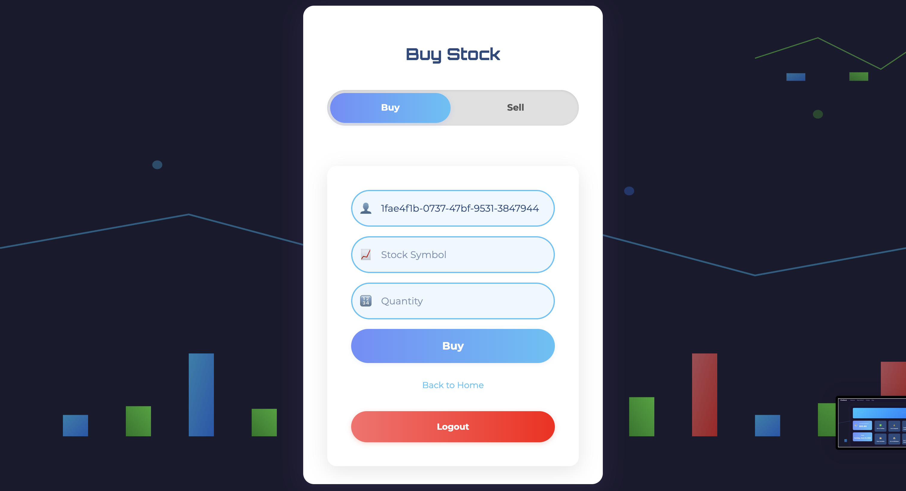
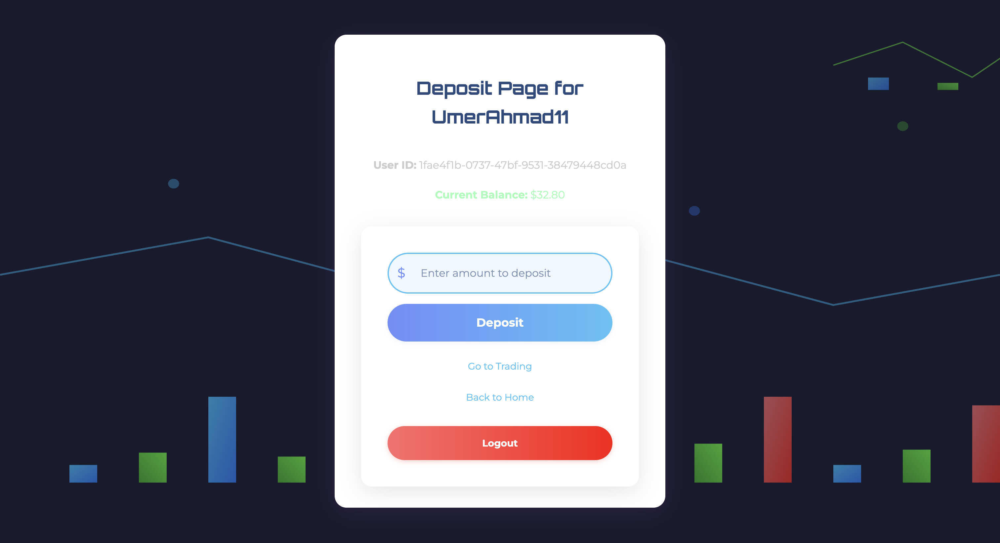
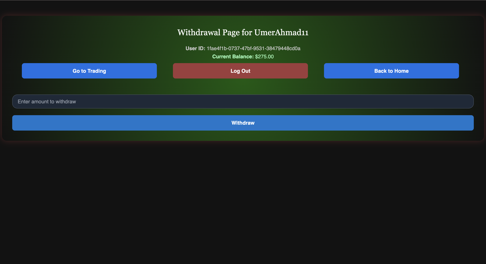
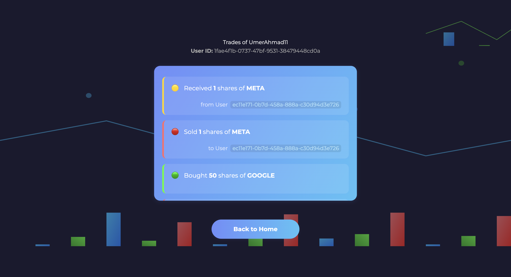

# 💼 FinPort: Simulated Stock Trading Platform

Welcome to **FinPort**, a fully functional simulated stock trading web application. It is designed to mimic real-world stock investment and trading behaviors, helping users build financial literacy in a controlled environment.

---

## 🚀 Features

- 🔐 User Authentication (Sign up / Login)
- 💸 Simulated Deposits & Withdrawals
- 📈 Stock Portfolio Management
- 🛒 Buy & Sell Stocks in Real-Time Simulation
- 📜 Trade History Tracking
- 💼 Balance & Holdings Overview
- 🎨 Modern UI with TailwindCSS
- 🧠 Prepared for AI-based assistant integration

---

## 🖼️ Screenshots

| Auth Page | Trading Page | Portfolio View |
|----------|--------------|----------------|
|  |  |  |

| Deposit Page | Withdraw Page | Front Page | Trade Tracker |
|--------------|---------------|-------------|----------------|
|  |  |  |  |

---

## 📂 Project Structure

```
backend/
├── api.py                # FastAPI routes
├── auth.py               # Login / Signup logic
├── deposit.py            # Deposit endpoint
├── withdraw.py           # Withdraw endpoint
├── portfolio.py          # Portfolio routes
├── trades.py             # Trade routes
├── portfolio_data.py     # Data logic for portfolios
├── storage_balance.py    # Balance retrieval
├── trades_tracker.py     # Trade log functions
├── schemas.py            # Pydantic models
├── storage.py            # Generic JSON storage handler
├── frontpage.py          # Landing logic
├── users.json            # User data
├── balances.json         # Simulated balance
├── portfolio.json        # Holdings
└── trades.json           # Trade history

frontend/
└── [React App here with TailwindCSS styling]
```

---

## 🔧 Tech Stack

- **Backend**: Python, FastAPI
- **Frontend**: React, TailwindCSS
- **Storage**: JSON files (for simulating DB)
- **Authentication**: bcrypt hashed passwords
- **Unique IDs**: UUID for user identification

---

## 🧪 Example Users

| Username    | Password     | Balance | Stocks      |
|-------------|--------------|---------|-------------|
| UmerAhmad11 | `test1234`   | $275    | 30 GOOGLE   |
| Salman55    | `test5678`   | $0      | 1 META, 20 GOOGLE |

---

## 📈 Example Trades

- Salman bought 2 META
- Salman sold 1 META to UmerAhmad11
- UmerAhmad11 bought 50 GOOGLE, sold 20 to Salman

Data is stored in:
- `trades.json`
- `portfolio.json`
- `balances.json`

---

## 🛠️ Setup Instructions

```bash
# 1. Clone the repo
git clone https://github.com/yourusername/finport.git
cd finport

# 2. Setup Python environment
cd backend
python3 -m venv venv
source venv/bin/activate
pip install -r requirements.txt

# 3. Run the FastAPI backend
uvicorn api:app --reload

# 4. Setup and run frontend
cd ../frontend
npm install
npm run dev
```

---

## 🔒 Security Notes

- Passwords are stored securely using bcrypt.
- Future upgrades should include:
  - Migration to a secure DB like PostgreSQL
  - JWT-based authentication
  - OAuth for third-party sign-in

---

## 📌 TODO

- [ ] Add real-time stock price API integration
- [ ] Add dashboard charts using Recharts or Chart.js
- [ ] Secure file-based data with database
- [ ] AI assistant integration for user tips

---

## 📃 License

MIT License. See [LICENSE](LICENSE) for details.

---

## ✨ Author

**Syed Umer Ahmad** — *Full-stack developer preparing for UBS Tech Graduate Program*  
📫 [LinkedIn](https://linkedin.com/in/your-profile) | [GitHub](https://github.com/yourusername)
